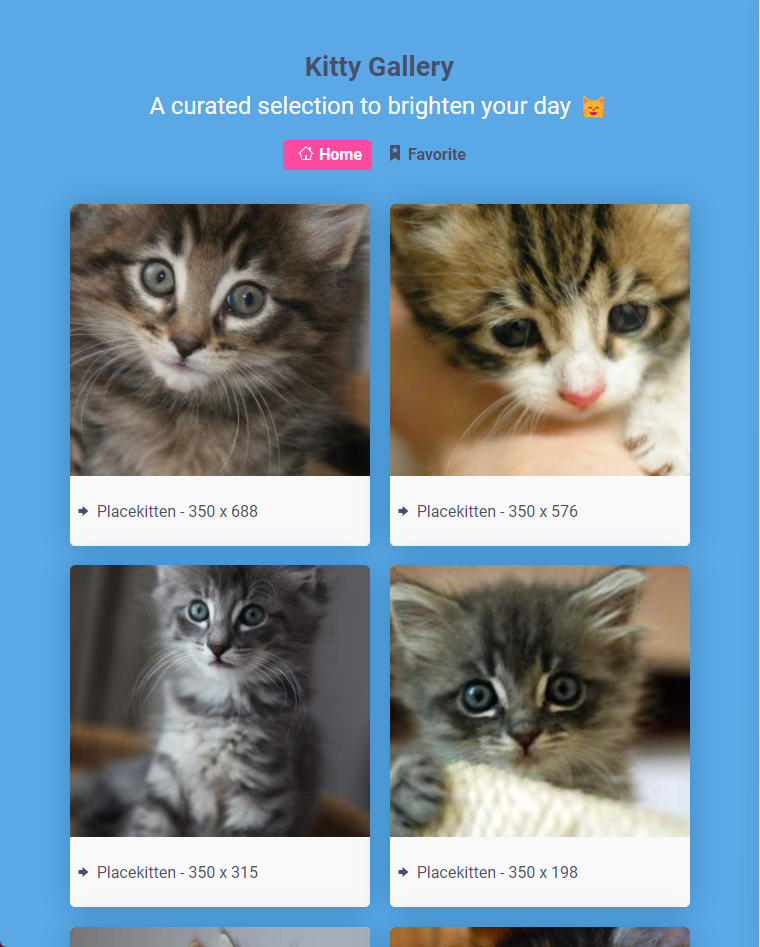
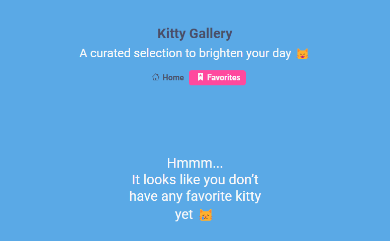

# Kitty Gallery

This project was made as a test for [XLR8 RMS](https://www.xlr8rms.com/).

This app is a gallery that has a favorites section and when a user clicks on an image it is added to the favorites list. If the user click again or click on the image in the favorites section, it gets removed from the list.

## The result

[Click here to check the result on Vercel](https://kitty-gallery.vercel.app/)

## Used technologies

The technologies used in this project are:

- TypeScript
- React (hooks, ContextApi)
- Sass

## To Run the project

Clone this repository on your local machine

Then run `yarn` to install the dependencies

To run de project use: `yarn start`

To test de project use: `yarn test`

## Screenshots

### Home Page

### Empty Favorites

